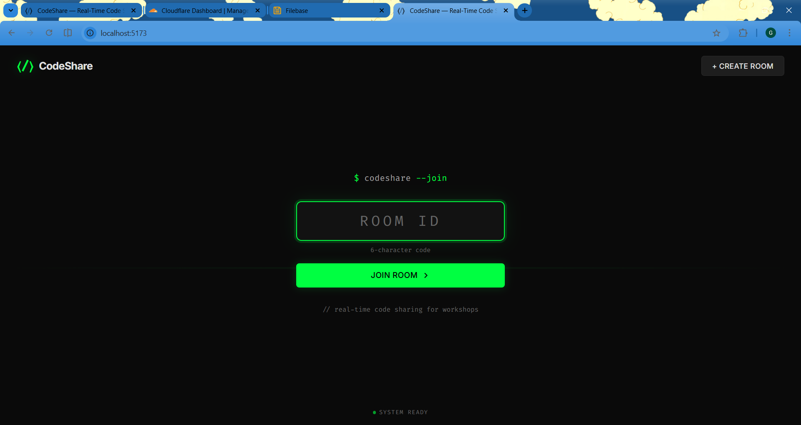

# CodeShare — Real-Time Collaborative Workspace

CodeShare is a professional, high-performance collaborative code editor and file-sharing platform. It features a modern, VS Code-inspired UI with real-time synchronization, multi-block management, and secure file storage.

 

## 🚀 Key Features

- **VS Code-Style Interface**: A professional three-column layout featuring a left-side Explorer, a central Active Editor, and a right-side File Management pane.
- **Collaborative Multi-Block Editing**: Create multiple code instances (files) within a single room. Each block supports independent language settings and real-time synchronization.
- **Automatic Extension Sync**: Changing the code language (e.g., from JavaScript to Python) automatically updates the file extension in the explorer (e.g., `main.js` → `main.py`).
- **Real-Time Renaming**: Admins can rename code blocks instantly, with changes broadcasting to all connected users in milliseconds.
- **Exit Room Control**: A dedicated "Exit Room" button for quick navigation back to the landing page, with persistent admin tokens for seamless re-entry.
- **Secure File Sharing**: Full integration with **Filebase (S3-compatible)**. Upload and manage shared assets with secure, pre-signed URLs.
- **Live Presence**: Track active users in the room in real-time.
- **Auto-Destruct**: Rooms and associated files are automatically purged after 2 hours of inactivity to ensure privacy and resource efficiency.
- **Full Dockerization**: One-command setup with healthchecks, volumes for hot-reloading, and orchestrated service startup.

## 🛠 Tech Stack

- **Frontend**: React.js (Vite), Socket.io-client, CSS3 (Vanilla)
- **Backend**: Node.js, Express, Socket.io
- **Database/State**: Redis (via ioredis)
- **Storage**: Filebase (S3-compatible Storage)
- **Infrastructure**: Docker & Docker Compose

## 🚦 Getting Started

### Prerequisites

- **Docker** and **Docker Compose** (Recommended)
- OR **Node.js (v20+)** and a local **Redis** instance.

### Run with Docker (Fastest)

1.  **Clone and Enter**:
    ```bash
    git clone https://github.com/Gaurravvvv/CodeShare.git
    cd CodeShare
    ```

2.  **Environment Setup**:
    Ensure `.env` files exist in both `client/` and `server/` directories (see variables below).

3.  **Start Services**:
    ```bash
    docker-compose up --build
    ```
    The app will be available at `http://localhost:5173`.

### Run Manually

1.  **Install Dependencies**:
    ```bash
    cd server && npm install
    cd ../client && npm install
    ```

2.  **Start Redis**:
    Ensure Redis is running locally on port 6379.

3.  **Run Development Servers**:
    - **Server**: `cd server && npm run dev` (Port 3001)
    - **Client**: `cd client && npm run dev` (Port 5173)

## ⚙️ Environment Variables

### Server (`server/.env`)
- `PORT`: Server port (default 3001)
- `CLIENT_URL`: URL of the frontend for CORS
- `REDIS_URL`: Redis connection string (use `redis://redis:6379` for Docker)
- `FILEBASE_KEY`: Filebase Access Key
- `FILEBASE_SECRET`: Filebase Secret Key
- `FILEBASE_BUCKET`: Filebase Bucket Name
- `FILEBASE_PUBLIC_URL`: Public URL for accessing files

### Client (`client/.env`)
- `VITE_API_URL`: Backend URL (e.g., `http://localhost:3001`)

## 📄 License

MIT License. See `LICENSE` for details.
