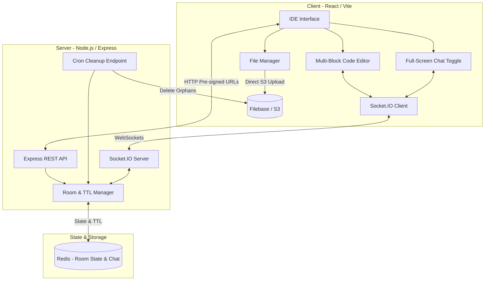

# CodeShare (Aether) — Real-Time Collaborative Workspace

CodeShare is a high-performance, real-time collaborative code editor and file-sharing platform designed for seamless pair programming, interviews, and remote team collaboration. Featuring a professional, VS Code-inspired UI, it supports synchronized multi-file editing, instant messaging, and secure file sharing with auto-destruct capabilities for privacy.

🌍 **Live Demo:** [https://codesharre.vercel.app](https://codesharre.vercel.app)

## 🏗️ Architecture Diagram


```mermaid
graph TD
    subgraph Frontend ["Client - React / Vite"]
        UI[IDE Interface]
        Editor[Multi-Block Code Editor]
        Chat[Full-Screen Chat Toggle]
        FileMan[File Manager]
        SocketClient[Socket.IO Client]
        
        UI --> Editor
        UI --> Chat
        UI --> FileMan
        Editor <--> SocketClient
        Chat <--> SocketClient
        FileMan -->|Direct S3 Upload| Storage[(Filebase / S3)]
    end

    subgraph Backend ["Server - Node.js / Express"]
        API[Express REST API]
        CronCleanup[Cron Cleanup Endpoint]
        SocketServer[Socket.IO Server]
        RoomService[Room & TTL Manager]
        
        API --> RoomService
        CronCleanup --> RoomService
        SocketServer <--> RoomService
    end

    subgraph Storage_Layer ["State & Storage"]
        Redis[(Redis - Room State & Chat)]
        Storage
    end

    SocketClient <-->|WebSockets| SocketServer
    UI <-->|HTTP Pre-signed URLs| API
    RoomService <-->|State & TTL| Redis
    CronCleanup -->|Delete Orphans| Storage
```

 

## 🚀 Key Features & How They Work

- **VS Code-Style Interface**: A clean two-panel layout with a left-side Explorer and a central Active Editor, plus a toggleable right-side File Management pane. Fully responsive for mobile, tablet, and split-screen windows.
- **Full-Screen Chat Toggle**: Chat and Code views share the same main viewport — click the toggle button in the header to seamlessly switch between them. No awkward side panels.
- **Unread Message Notifications**: When you're in the editor and someone sends a chat message, a live notification badge with unread count pops up on the Chat button so you never miss a message.
- **Collaborative Multi-Block Editing**: Create multiple code files (blocks) within a single room. Each block synchronizes code changes in real-time across all connected clients via Socket.IO.
- **Smart Language Detection**: Changing the file extension in the explorer (e.g., `script.js` → `script.py`) automatically updates the editor's syntax highlighting for that specific language block.
- **Admin Access Control**: The user who creates the room is granted Admin privileges via a secure, persistent token. Only Admins can rename blocks, add/delete code blocks, or upload files to prevent griefing.
- **Secure File Sharing & In-Browser Preview**: Full integration with **Filebase (S3-compatible object storage)**. Upload and manage shared assets using secure, pre-signed URLs. The file list is scrollable when many files are uploaded. Click the 👁 **View** button to preview files directly in the browser! Supports images, video, audio, PDFs, spreadsheets (XLSX/CSV), GitHub-flavored Markdown (.md), and even PowerPoint presentations (PPTX) via backend LibreOffice conversion.
- **AI Code Analysis Agent**: Click the ✨ **Summarize** button on any file or inline code block to run it through our AI Agent powered by **Groq (Llama 3)**. For code files, it generates a high-level summary *and* actively detects bugs, typos, and security vulnerabilities (flagged as warnings). For standard documents (PDF, DOCX, XLSX, PPTX) and plain text, it provides a concise paragraph summary. All AI responses use structured JSON parsing and are cached in Redis for 1 hour for instant retrieval without hitting API limits.
- **Live Room Chat & Presence**: Track active users with a live online count and participate in real-time room chat with rich mentions (`@user`, `#code-file`, `$media`). Chat messages are synchronized and persisted in Redis.
- **Auto-Destruct & Cron Cleanup**: Privacy by design. Rooms have a TTL (Time-To-Live). Redis keyspace events trigger automatic cleanup. A dedicated **cron endpoint** (`POST /api/rooms/cron/cleanup`) reconciles orphaned S3 files against Redis, ensuring nothing is left behind even if the server was asleep during expiration.
- **Full Dockerization**: One-command setup with healthchecks, volumes for hot-reloading, and orchestrated service startup across Frontend, Backend, and Redis.
- **Mobile Responsive**: The entire UI gracefully adapts to mobile screens and narrow split-screen windows with proper breakpoints at 1024px, 768px, and 480px. On smaller devices, the top header intelligently collapses into clean icon-only buttons (➕, 🚪, ★) to maximize horizontal real estate for the code editor.

## 🏗️ Architecture & Tech Stack

CodeShare is built on a modern JavaScript ecosystem, prioritizing speed, real-time capabilities, and scalability.

### 1. Frontend (Client)
- **Framework**: React.js (via Vite for lightning-fast HMR and optimized builds).
- **Styling**: Vanilla CSS3 using BEM conventions for lightweight, conflict-free styling.
- **Real-Time Communication**: `socket.io-client` handles the persistent connection to the backend, broadcasting code changes, chat messages, and user presence instantly.
- **Why?**: React offers excellent component-based state management necessary for an IDE-like interface, while Vite provides the best developer experience in the current ecosystem.

### 2. Backend (Server)
- **Runtime**: Node.js with Express.js for REST API routes (room creation, admin validation).
- **WebSockets**: `socket.io` manages rooms, broadcasts events (code updates, chat, file operations), and handles client disconnections seamlessly.
- **Why?**: Node.js shines in I/O-heavy, real-time applications. Socket.IO provides reliable WebSocket connections with built-in broadcasting and fallback polling.

### 3. State & Database (Redis)
- **Library**: `ioredis`
- **Usage**: Redis acts as the single source of truth for the active application state. It stores:
  - Room data (code blocks, connected users).
  - Chat history.
  - TTL (Time-To-Live) keys to manage room expiration.
- **Why?**: Redis is an in-memory data store, making it incredibly fast. This is crucial when syncing keystrokes across multiple users in milliseconds. It also natively supports keyspace notifications used for the auto-destruct feature.

### 4. Storage (Filebase / AWS S3 SDK)
- **Library**: `@aws-sdk/client-s3` and `@aws-sdk/s3-request-presigner`
- **Usage**: When a file is uploaded, the backend generates an S3 Pre-signed PUT URL. The client uploads the file directly to Filebase (S3-compatible decentralized storage), bypassing the Node server to save bandwidth. 
- **Why?**: Offloading file storage to an S3-compatible bucket ensures the Node backend remains performant and isn't bogged down by heavy file buffers. Filebase offers decentralized, highly available storage.

## 🚦 Getting Started

### Prerequisites

- **Docker Desktop** (for Redis container)
- **Node.js (v20+)**
- **LibreOffice** (optional, but required for local PPTX to PDF preview conversion)

### Option 1: Quick Start with `run.bat` (Windows)

The project includes a `run.bat` file that starts everything in one click:

1. **Clone the repository**:
   ```bash
   git clone https://github.com/Gaurravvvv/CodeShare.git
   cd CodeShare
   ```

2. **Setup environment variables** (see below).

3. **Double-click `run.bat`** — it will:
   - Start a Redis container via Docker (auto-creates if not exists)
   - Launch the Backend dev server (port 3001)
   - Launch the Frontend dev server (port 5173)

### Option 2: Run with Docker Compose

```bash
docker-compose up --build
```
*Starts Redis, Backend, and Frontend. App available at `http://localhost:5173`.*

### Option 3: Run Manually

1. **Start Redis**:
   ```bash
   docker run -d --name codeshare-redis -p 6379:6379 redis:7-alpine
   ```

2. **Backend**:
   ```bash
   cd server && npm install && npm run dev
   ```

3. **Frontend**:
   ```bash
   cd client && npm install && npm run dev
   ```

## ⚙️ Environment Variables

### Server (`server/.env`)
Create this file in the `server/` directory.

| Variable | Description | Default / Example |
|---|---|---|
| `PORT` | The port the Node server runs on | `3001` |
| `CLIENT_URL` | URL of the frontend (for CORS and Socket origins) | `http://localhost:5173` |
| `REDIS_URL` | Redis connection string. Use `redis://redis:6379` if using Docker, or `redis://localhost:6379` for local. | `redis://redis:6379` |
| `FILEBASE_KEY` | Your Filebase Access Key | `your_access_key` |
| `FILEBASE_SECRET`| Your Filebase Secret Key | `your_secret_key` |
| `FILEBASE_BUCKET`| The Filebase Bucket Name to store uploaded files | `codeshare-bucket` |
| `CRON_SECRET`    | Secret token to authenticate the cleanup cron job | `your_super_secret_string` |
| `GROQ_API_KEY`   | API key for Groq AI summarization (get from [console.groq.com](https://console.groq.com)) | `gsk_...` |

*(Note: Filebase requires an account. You can replace Filebase with AWS S3 credentials as the SDK is compatible).*

### 🧹 Cron Job Cleanup Setup (For Cloud PaaS)
If your backend is hosted on a free tier (like Render) that sleeps on inactivity, Redis keyspace events might be missed. To ensure uploaded files are deleted when rooms expire, we have a cron endpoint.
1. Set a strong `CRON_SECRET` in your server environment variables.
2. Use a free service like [cron-job.org](https://cron-job.org/) to send a `POST` request to `https://your-backend-url.com/api/rooms/cron/cleanup` every 6 hours.
3. The body must be JSON: `{"secret": "your_super_secret_string"}`.

### Client (`client/.env`)
Create this file in the `client/` directory.

| Variable | Description | Default / Example |
|---|---|---|
| `VITE_API_URL` | The URL where the frontend can reach the Node backend API and WebSocket server. | `http://localhost:3001` |

## 📁 Project Structure

```text
CodeShare/
├── run.bat                 # One-click dev launcher (Redis + Backend + Frontend)
├── client/                 # React Frontend (Vite)
│   ├── public/             # Static assets (Favicon, Screenshots)
│   ├── src/
│   │   ├── components/     # UI: ChatPanel, CodeEditor, FileList, FilePreviewModal, SummaryCard, RoomHeader
│   │   ├── hooks/          # Custom React hooks (useSocket.js)
│   │   ├── pages/          # Landing.jsx, Room.jsx (+ CSS)
│   │   ├── utils/          # API helpers and Axios instances
│   │   └── App.jsx         # App routing
│   ├── Dockerfile
│   └── package.json
├── server/                 # Node.js Backend
│   ├── src/
│   │   ├── config/         # Redis connection config
│   │   ├── routes/         # REST routes (Rooms, Upload, Cron Cleanup, Preview)
│   │   ├── services/       # roomService, filebaseService (S3 + orphan cleanup)
│   │   ├── socket/         # Socket.io event handlers
│   │   └── index.js        # Server entry point
│   ├── Dockerfile
│   └── package.json
├── docker-compose.yml      # Orchestrates Client, Server, and Redis containers
└── README.md
```

## 🤝 Contributing

Contributions, issues, and feature requests are welcome!
Feel free to check the issues page if you want to contribute.

## 📄 License

This project is licensed under the MIT License.
