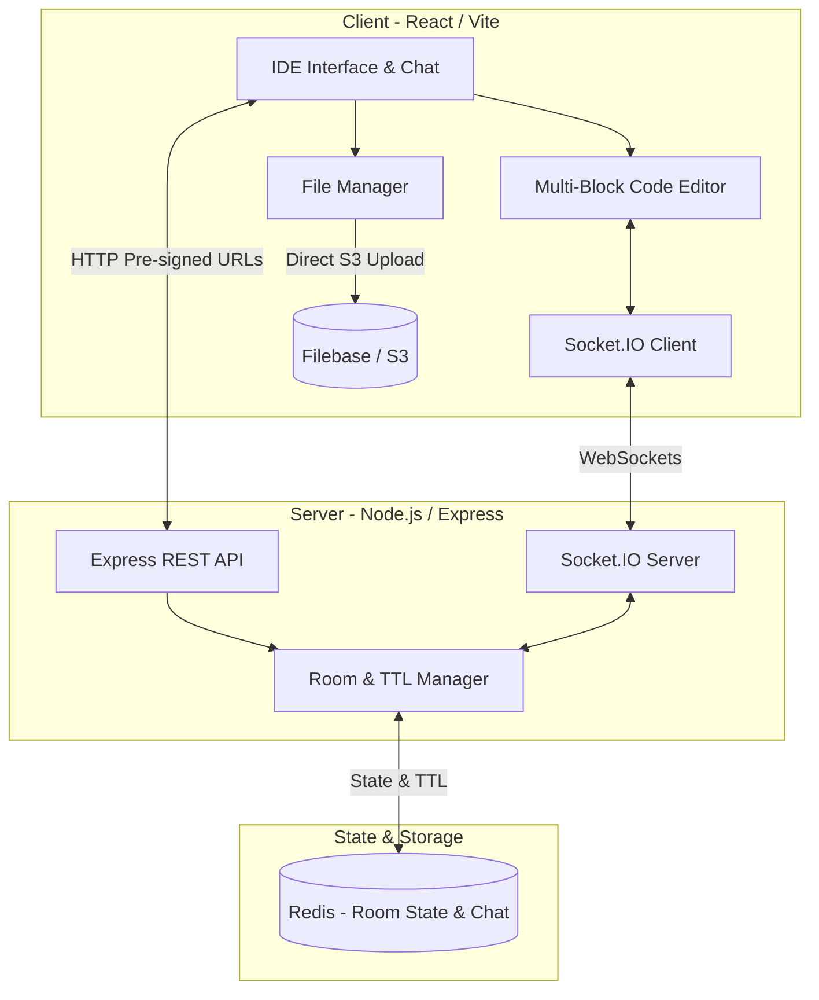

# CodeShare (Aether) — Real-Time Collaborative Workspace

CodeShare is a high-performance, real-time collaborative code editor and file-sharing platform designed for seamless pair programming, interviews, and remote team collaboration. Featuring a professional, VS Code-inspired UI, it supports synchronized multi-file editing, instant messaging, and secure file sharing with auto-destruct capabilities for privacy.

🌍 **Live Demo:** [https://codesharre.vercel.app](https://codesharre.vercel.app)

## 🏗️ Architecture Diagram


```mermaid
graph TD
    subgraph Frontend [Client - React / Vite]
        UI[IDE Interface & Chat]
        Editor[Multi-Block Code Editor]
        FileMan[File Manager]
        SocketClient[Socket.IO Client]
        
        UI --> Editor
        UI --> FileMan
        Editor <--> SocketClient
        FileMan -->|Direct S3 Upload| Storage[(Filebase / S3)]
    end

    subgraph Backend [Server - Node.js / Express]
        API[Express REST API]
        SocketServer[Socket.IO Server]
        RoomService[Room & TTL Manager]
        
        API --> RoomService
        SocketServer <--> RoomService
    end

    subgraph State & Storage
        Redis[(Redis - Room State & Chat)]
        Storage
    end

    SocketClient <-->|WebSockets| SocketServer
    UI <-->|HTTP Pre-signed URLs| API
    RoomService <-->|State & TTL| Redis
```

 

## 🚀 Key Features & How They Work

- **VS Code-Style Interface**: A professional three-column layout featuring a left-side Explorer, a central Active Editor, and a right-side File Management & Chat pane.
- **Collaborative Multi-Block Editing**: Create multiple code files (blocks) within a single room. Each block synchronizes code changes in real-time across all connected clients via Socket.IO.
- **Smart Language Detection**: Changing the file extension in the explorer (e.g., `script.js` → `script.py`) automatically updates the editor's syntax highlighting for that specific language block.
- **Admin Access Control**: The user who creates the room is granted Admin privileges via a secure, persistent token. Only Admins can rename blocks, add/delete code blocks, or upload files to prevent griefing.
- **Secure File Sharing**: Full integration with **Filebase (S3-compatible object storage)**. Upload and manage shared assets using secure, pre-signed URLs.
- **Live Room Chat & Presence**: Track active users with a live online count and participate in real-time room chat. Chat messages are synchronized and persisted in Redis.
- **Auto-Destruct & Cleanup**: Privacy by design. Rooms have a TTL (Time-To-Live). After an extended period of inactivity, Redis triggers a keyspace expiration event that automatically cleans up the room's state in the database and triggers a webhook to delete all associated files from Filebase.
- **Full Dockerization**: One-command setup with healthchecks, volumes for hot-reloading, and orchestrated service startup across Frontend, Backend, and Redis.

## 🏗️ Architecture & Tech Stack

CodeShare is built on a modern JavaScript ecosystem, prioritizing speed, real-time capabilities, and scalability.

### 1. Frontend (Client)
- **Framework**: React.js (via Vite for lightning-fast HMR and optimized builds).
- **Styling**: Vanilla CSS3 using BEM conventions for lightweight, conflict-free styling.
- **Real-Time Communication**: `socket.io-client` handles the persistent connection to the backend, broadcasting code changes, chat messages, and user presence instantly.
- **Why?**: React offers excellent component-based state management necessary for an IDE-like interface, while Vite provides the best developer experience in the current ecosystem.

### 2. Backend (Server)
- **Runtime**: Node.js with Express.js for REST API routes (room creation, admin validation).
- **WebSockets**: `socket.io` manages rooms, broadcasts events (code updates, chat, file operations), and handles client disconnections seamlessly.
- **Why?**: Node.js shines in I/O-heavy, real-time applications. Socket.IO provides reliable WebSocket connections with built-in broadcasting and fallback polling.

### 3. State & Database (Redis)
- **Library**: `ioredis`
- **Usage**: Redis acts as the single source of truth for the active application state. It stores:
  - Room data (code blocks, connected users).
  - Chat history.
  - TTL (Time-To-Live) keys to manage room expiration.
- **Why?**: Redis is an in-memory data store, making it incredibly fast. This is crucial when syncing keystrokes across multiple users in milliseconds. It also natively supports keyspace notifications used for the auto-destruct feature.

### 4. Storage (Filebase / AWS S3 SDK)
- **Library**: `@aws-sdk/client-s3` and `@aws-sdk/s3-request-presigner`
- **Usage**: When a file is uploaded, the backend generates an S3 Pre-signed PUT URL. The client uploads the file directly to Filebase (S3-compatible decentralized storage), bypassing the Node server to save bandwidth. 
- **Why?**: Offloading file storage to an S3-compatible bucket ensures the Node backend remains performant and isn't bogged down by heavy file buffers. Filebase offers decentralized, highly available storage.

## 🚦 Getting Started

### Prerequisites

- **Docker** and **Docker Compose** (Highly Recommended for easiest setup)
- OR **Node.js (v20+)** and a local **Redis** instance (v7+).

### Option 1: Run with Docker (Recommended)

1. **Clone the repository**:
   ```bash
   git clone https://github.com/Gaurravvvv/CodeShare.git
   cd CodeShare
   ```

2. **Environment Variables Setup**:
   Copy `.env.example` (if available) or create `.env` files in both the `client/` and `server/` directories. See the **Environment Variables** section below.

3. **Start Services**:
   ```bash
   docker-compose up --build
   ```
   *Docker Compose will start Redis, the Node Backend, and the React Frontend. It handles network bridging and volume mapping automatically.*
   
   The app will be available at `http://localhost:5173`.

### Option 2: Run Manually (Local Development)

1. **Start Redis**:
   Ensure you have a Redis server running locally on port `6379`.
   *Note: For room auto-cleanup to work, ensure keyspace events are enabled in Redis (`redis-cli config set notify-keyspace-events Ex`).*

2. **Install Backend Dependencies & Run**:
   ```bash
   cd server
   npm install
   npm run dev
   ```
   *Runs on port 3001.*

3. **Install Frontend Dependencies & Run**:
   ```bash
   cd client
   npm install
   npm run dev
   ```
   *Runs on port 5173.*

## ⚙️ Environment Variables

### Server (`server/.env`)
Create this file in the `server/` directory.

| Variable | Description | Default / Example |
|---|---|---|
| `PORT` | The port the Node server runs on | `3001` |
| `CLIENT_URL` | URL of the frontend (for CORS and Socket origins) | `http://localhost:5173` |
| `REDIS_URL` | Redis connection string. Use `redis://redis:6379` if using Docker, or `redis://localhost:6379` for local. | `redis://redis:6379` |
| `FILEBASE_KEY` | Your Filebase Access Key | `your_access_key` |
| `FILEBASE_SECRET`| Your Filebase Secret Key | `your_secret_key` |
| `FILEBASE_BUCKET`| The Filebase Bucket Name to store uploaded files | `codeshare-bucket` |
| `CRON_SECRET`    | Secret token to authenticate the cleanup cron job | `your_super_secret_string` |

*(Note: Filebase requires an account. You can replace Filebase with AWS S3 credentials as the SDK is compatible).*

### 🧹 Cron Job Cleanup Setup (For Cloud PaaS)
If your backend is hosted on a free tier (like Render) that sleeps on inactivity, Redis keyspace events might be missed. To ensure uploaded files are deleted when rooms expire, we have a cron endpoint.
1. Set a strong `CRON_SECRET` in your server environment variables.
2. Use a free service like [cron-job.org](https://cron-job.org/) to send a `POST` request to `https://your-backend-url.com/api/rooms/cron/cleanup` every 6 hours.
3. The body must be JSON: `{"secret": "your_super_secret_string"}`.

### Client (`client/.env`)
Create this file in the `client/` directory.

| Variable | Description | Default / Example |
|---|---|---|
| `VITE_API_URL` | The URL where the frontend can reach the Node backend API and WebSocket server. | `http://localhost:3001` |

## 📁 Project Structure

```text
CodeShare/
├── client/                 # React Frontend (Vite)
│   ├── public/             # Static assets (Favicon, Screenshots)
│   ├── src/
│   │   ├── components/     # Reusable UI components (ChatPanel, CodeEditor, FileList)
│   │   ├── hooks/          # Custom React hooks (useSocket.js)
│   │   ├── pages/          # Main views (Landing.jsx, Room.jsx)
│   │   ├── utils/          # API helpers and Axios instances
│   │   └── App.jsx         # App routing
│   ├── Dockerfile
│   └── package.json
├── server/                 # Node.js Backend
│   ├── src/
│   │   ├── config/         # Redis connection config
│   │   ├── routes/         # Express REST routes (Rooms, Upload presigning)
│   │   ├── services/       # Business logic (Redis queries, Filebase S3 operations)
│   │   ├── socket/         # Socket.io event handlers
│   │   └── index.js        # Server entry point
│   ├── Dockerfile
│   └── package.json
├── docker-compose.yml      # Orchestrates Client, Server, and Redis containers
└── README.md
```

## 🤝 Contributing

Contributions, issues, and feature requests are welcome!
Feel free to check the issues page if you want to contribute.

## 📄 License

This project is licensed under the MIT License.
