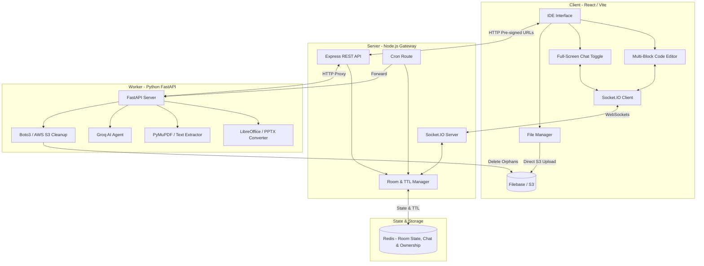
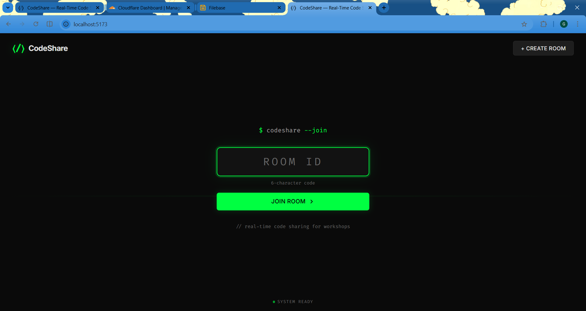

# CodeShare (Aether) — Real-Time Collaborative Workspace

CodeShare is a high-performance, real-time collaborative code editor and file-sharing platform designed for seamless pair programming, interviews, and remote team collaboration. Featuring a professional, VS Code-inspired UI, it supports synchronized multi-file editing, instant messaging, resource-level ownership, and secure file sharing with auto-destruct capabilities for privacy.

🌍 **Live Demo:** [https://codesharre.vercel.app](https://codesharre.vercel.app)

---

## 🏗️ Architecture Diagram


```mermaid
graph TD
    subgraph Frontend ["Client - React / Vite"]
        UI[IDE Interface]
        Editor[Multi-Block Code Editor]
        Chat[Full-Screen Chat Toggle]
        FileMan[File Manager]
        SocketClient[Socket.IO Client]
        
        UI --> Editor
        UI --> Chat
        UI --> FileMan
        Editor <--> SocketClient
        Chat <--> SocketClient
        FileMan -->|Direct S3 Upload| Storage[(Filebase / S3)]
    end

    subgraph Backend ["Server - Node.js Gateway"]
        API[Express REST API]
        CronCleanup[Cron Route]
        SocketServer[Socket.IO Server]
        RoomService[Room & TTL Manager]
        
        API --> RoomService
        CronCleanup --> RoomService
        SocketServer <--> RoomService
    end

    subgraph Microservice ["Worker - Python FastAPI"]
        FastAPI[FastAPI Server]
        LibreOffice[LibreOffice / PPTX Converter]
        PyMuPDF[PyMuPDF / Text Extractor]
        Groq[Groq AI Agent]
        Boto3[Boto3 / AWS S3 Cleanup]

        FastAPI --> LibreOffice
        FastAPI --> PyMuPDF
        FastAPI --> Groq
        FastAPI --> Boto3
    end

    subgraph Storage_Layer ["State & Storage"]
        Redis[(Redis - Room State, Chat & Ownership)]
        Storage
    end

    SocketClient <-->|WebSockets| SocketServer
    UI <-->|HTTP Pre-signed URLs| API
    API <-->|HTTP Proxy| FastAPI
    CronCleanup -->|Forward| FastAPI
    Boto3 -->|Delete Orphans| Storage
    RoomService <-->|State & TTL| Redis
```

 

---

## 🚀 Key Features & Detailed Workflows

### 1. Dual-Viewport VS Code-Inspired UI & Mobile Responsiveness
*   **Split Layout**: Features a left-side Explorer sidebar, a central code editor supporting multiple file tabs, a right-side toggleable File Manager, and a collapsible room activity footer.
*   **Adaptive Viewport Toggle**: To keep the screen clean, Chat and Code views share the same main viewport. Users toggle between them via the header. Unread messages trigger badge counters on the header toggle.
*   **BEM Styling System**: Developed in Vanilla CSS3 adhering to Block-Element-Modifier (BEM) naming conventions for clean, modular, and performant styles without CSS utility bloat.
*   **Mobile Adaptability (<768px)**: 
    *   Header buttons dynamically collapse to compact icons (e.g., ➕ for Add Block, 🚪 for Leave Room, ★ for Host).
    *   Code editor control bars hide text labels (e.g., "Summary", "Copy", "Delete") and render only SVG icons.
    *   Clicking a file block in the Explorer automatically closes the mobile dropdown menu (`setIsMobileMenuOpen(false)`) to prevent viewport obstruction.

### 2. Collaborative Multi-Block Editing & Latency Compensation
*   **Multi-Block Architecture**: Rooms can hold multiple code files (blocks) simultaneously. Active document content, filenames, and language configurations sync in real time.
*   **Zero-Lag Typing (Latency Compensation)**:
    *   To prevent network-roundtrip cursor stutter and keyboard lag, the client maintains a local state (`localCode`) inside the [CodeEditor.jsx](file:///c:/Users/VICTUS/OneDrive/Desktop/Internship/Personal/Code%20Share/client/src/components/CodeEditor.jsx).
    *   Typing updates the UI immediately. A `useRef` debounce timer waits **1000ms** before dispatching the `code-update` event to the backend.
    *   Remote `code-updated` socket events update the client's local state **only** if the remote value differs from the local text buffer, preventing caret jumps and editing conflicts.
*   **Tab Indentation Interceptor**: Replaces the browser's default tab-focus navigation behavior in the editor textarea, inserting two spaces (`  `) at the current cursor position instead.

### 3. Dynamic Host & Resource Ownership System
*   **Ownership Boundaries**: Every created code block and uploaded file is stamped with the creator's connection socket ID (`ownerId`). 
*   **Read-Only Safeguards**: Non-owners see a locked **READ ONLY** badge and have edit, rename, and delete buttons hidden. Owners see a **You** badge to identify their assets.
*   **Redis-Backed Host Queue**: 
    *   The room state tracks a `joinOrder` list in Redis. The first/oldest socket in the list is designated as the **Host** (★ HOST badge).
    *   Hosts override all ownership verification checks and retain global rights to rename, modify, or delete any resource in the room.
*   **Role Promotion & Asset Migration**:
    *   When the Host leaves, the backend [roomService.js](file:///c:/Users/VICTUS/OneDrive/Desktop/Internship/Personal/Code%20Share/server/src/services/roomService.js) removes them from `joinOrder`, promotes `joinOrder[0]` to the new Host, and broadcasts a `host-updated` socket event.
    *   Resources owned by the departing Host are transferred to the newly promoted Host.
    *   If a non-host user disconnects, all their resources are transferred to the current Host.
    *   If a room is empty and a new user joins, they automatically inherit all orphan files and code blocks.
*   **Latency-Safe Connection Tracking**: Resolves the initial socket connection delay (first 50ms) by returning the user's socket ID in the server's `room-state` payload, saved as `mySocketId` for instantaneous local ownership validation.

### 4. In-Browser File Preview Engine
Clicking the 👁 **View** button next to any file in the File list opens a glassmorphism modal [FilePreviewModal.jsx](file:///c:/Users/VICTUS/OneDrive/Desktop/Internship/Personal/Code%20Share/client/src/components/FilePreviewModal.jsx) with custom file-type renderers:
*   **Media files**: Native `<audio>`, `<video>`, and `` players.
*   **DOCX**: Parsed in-browser using `mammoth.js` to render high-fidelity HTML directly.
*   **XLSX / CSV**: Loaded into memory via SheetJS (`xlsx`), parsed into JSON rows, and rendered as a stylized HTML table.
*   **PDF**: Integrated native PDF viewer powered by `pdfjs-dist`.
*   **PPTX (Server-Side FastAPI Conversion)**:
    *   PPTX cannot be natively read in-browser. The client fires a request to `POST /api/preview/pptx` with the file URL.
    *   The Node.js server acts as an API gateway, forwarding the request to the Python **FastAPI microservice**.
    *   FastAPI retrieves the file buffer, saves it in a temporary folder, and spins up a headless LibreOffice process (`soffice --headless --convert-to pdf`).
    *   The FastAPI server returns the converted PDF buffer back through Node.js to the client, which renders it using the PDF previewer.

### 5. AI Code Analysis & Document Summarization Agent
Powered by **Groq Cloud API** using the `llama-3.3-70b-versatile` model, users can analyze code or documents with one click:
*   **Python Microservice Pipeline**: Heavy text extraction and API calls are offloaded to FastAPI to prevent blocking the Node.js WebSocket event loop.
    *   **PDF**: Text extracted on the Python server via `PyMuPDF` (pymupdf).
    *   **DOCX**: Text extracted via `python-docx`.
    *   **XLSX**: Spreadsheets parsed by `pandas` and formatted as text.
    *   **PPTX**: Converted to PDF via LibreOffice, then PDF text-extracted.
*   **Rate-Limit Truncation**: Inputs are truncated to 1200 words to respect free-tier Groq API rates.
*   **Analysis Modes**:
    *   **Code Mode**: Prompted to return a JSON payload containing a `summary` and `warnings` array. The AI scans the code for security vulnerabilities, syntax errors, and performance bugs. Detected issues display under yellow warning callouts in the [SummaryCard.jsx](file:///c:/Users/VICTUS/OneDrive/Desktop/Internship/Personal/Code%20Share/client/src/components/SummaryCard.jsx).
    *   **Document Mode**: Returns a single concise paragraph summary of the text.
*   **Caching**: AI analysis results are cached in Redis for **1 hour** (`3600 seconds`) under `summary:${fileName}:${fileUrl}` keys to avoid redundant API fees.

### 6. Auto-Destruct & Cron Cleanup
*   **Room Expire (TTL)**: Redis keys for rooms, active users, chat messages, and ownership hashes are configured with a **2-hour TTL** (7200 seconds). Any room activity (chat message, code modification, join event) resets this TTL.
*   **FastAPI Cron-Backed Orphan Reconciler**: 
    *   If a backend server sleeps (e.g., Render/Heroku free tiers), Redis keyspace notifications for expiration may be missed, leaving orphaned files in the storage bucket.
    *   A secure endpoint `POST /api/rooms/cron/cleanup` is protected by `CRON_SECRET`.
    *   Node.js forwards this request to FastAPI, which uses `boto3` (AWS SDK for Python) to list folders inside `rooms/` on Filebase.
    *   It parses the room IDs, checks Redis for room existence, and purges files from the bucket if the room has expired.

---

## 🏗️ Architecture & Tech Stack

CodeShare is built on a modern JavaScript ecosystem, prioritizing speed, real-time capabilities, and scalability.

### 1. Frontend (Client)
*   **Framework**: React.js (built with Vite for fast HMR and optimized bundle builds).
*   **Styling**: Vanilla CSS3 using BEM conventions for lightweight, conflict-free styling.
*   **Real-Time**: `socket.io-client` handles the persistent connection to the backend, broadcasting code changes, chat messages, and user presence instantly.
*   **In-browser Renderers**: `pdfjs-dist` (PDF preview), `mammoth` (Word document HTML parsing), and `xlsx` (Excel sheet processing).

### 2. Backend (Node.js Gateway)
*   **Runtime**: Node.js with Express.js for REST API routes and acting as an HTTP proxy.
*   **WebSockets**: `socket.io` manages rooms, broadcasts events (code updates, chat, file operations), and handles client disconnections without being blocked by heavy CPU tasks.

### 3. Microservice (Python FastAPI)
*   **Runtime**: Python 3.11 with FastAPI.
*   **Purpose**: Offloads all heavy, blocking operations from the Node.js event loop.
*   **Capabilities**: Headless LibreOffice binary execution for PPTX, PyMuPDF for PDF text extraction, Pandas for XLSX parsing, Boto3 for AWS S3 cleanup, and direct integration with the Groq AI API.

### 3. State & Database (Redis)
*   **Library**: `ioredis`
*   **Usage**: Redis acts as the single source of truth for the active application state. It stores:
    *   Room data (code blocks with `ownerId`, connected users).
    *   `joinOrder` array for dynamic Host role assignment and ownership transfer.
    *   User identity hash (`room:{id}:users`) for accurate user counting.
    *   Chat history.
    *   TTL (Time-To-Live) keys to manage room expiration.

### 4. Storage (Filebase / AWS S3 SDK)
*   **Library**: `@aws-sdk/client-s3` and `@aws-sdk/s3-request-presigner`
*   **Usage**: When a file is uploaded, the backend generates an S3 Pre-signed PUT URL. The client uploads the file directly to Filebase (S3-compatible decentralized storage), bypassing the Node server to save bandwidth.

---

## 🚦 Getting Started

### Prerequisites
*   **Docker Desktop** (for Redis container)
*   **Node.js (v20+)**
*   **LibreOffice** (optional, but required for local PPTX to PDF preview conversion)

### Option 1: Quick Start with `run.bat` (Windows)
The project includes a `run.bat` file that starts everything in one click:
1.  **Clone the repository**:
    ```bash
    git clone https://github.com/Gaurravvvv/CodeShare.git
    cd CodeShare
    ```
2.  **Setup environment variables** (see below).
3.  **Double-click `run.bat`** — it will:
    *   Start a Redis container via Docker (auto-creates if not exists)
    *   Launch the Python FastAPI microservice (port 8000)
    *   Launch the Node.js Backend gateway (port 3001)
    *   Launch the React Frontend (port 5173)

### Option 2: Run with Docker Compose
```bash
docker-compose up --build
```
*Starts Redis, FastAPI, Node Backend, and React Frontend. App available at `http://localhost:5173`.*

### Option 3: Run Manually
1.  **Start Redis**:
    ```bash
    docker run -d --name codeshare-redis -p 6379:6379 redis:7-alpine
    ```
2.  **Backend**:
    ```bash
    cd server && npm install && npm run dev
    ```
3.  **Frontend**:
    ```bash
    cd client && npm install && npm run dev
    ```

---

## ⚙️ Environment Variables

### Server (`server/.env`)
Create this file in the `server/` directory.

| Variable | Description | Default / Example |
| :--- | :--- | :--- |
| `PORT` | The port the Node server runs on | `3001` |
| `CLIENT_URL` | URL of the frontend (for CORS and Socket origins) | `http://localhost:5173` |
| `REDIS_URL` | Redis connection string. Use `redis://redis:6379` if using Docker, or `redis://localhost:6379` for local. | `redis://redis:6379` |
| `FILEBASE_KEY` | Your Filebase Access Key | `your_access_key` |
| `FILEBASE_SECRET` | Your Filebase Secret Key | `your_secret_key` |
| `FILEBASE_BUCKET` | The Filebase Bucket Name to store uploaded files | `codeshare-bucket` |
| `CRON_SECRET` | Secret token to authenticate the cleanup cron job | `your_super_secret_string` |
| `GROQ_API_KEY` | API key for Groq AI summarization (get from [console.groq.com](https://console.groq.com)) | `gsk_...` |

*(Note: Filebase requires an account. You can replace Filebase with AWS S3 credentials as the SDK is compatible).*

### Client (`client/.env`)
Create this file in the `client/` directory.

| Variable | Description | Default / Example |
| :--- | :--- | :--- |
| `VITE_API_URL` | The URL where the frontend can reach the Node backend API and WebSocket server. | `http://localhost:3001` |

---

## 🧹 Cron Job Cleanup Setup (For Cloud PaaS)
If your backend is hosted on a free tier (like Render) that sleeps on inactivity, Redis keyspace events might be missed. To ensure uploaded files are deleted when rooms expire, we have a cron endpoint.
1.  Set a strong `CRON_SECRET` in your server environment variables.
2.  Use a free service like [cron-job.org](https://cron-job.org/) to send a `POST` request to `https://your-backend-url.com/api/rooms/cron/cleanup` every 6 hours.
3.  The body must be JSON: `{"secret": "your_super_secret_string"}`.

---

## 📁 Project Structure

```text
CodeShare/
├── .github/workflows/      # CI/CD Workflows
│   └── ci.yml              # GitHub Actions CI (Build, Trivy scan, push to GHCR)
├── .bin/                   # Local binary tools (kind, kubectl, helm)
├── client/                 # React Frontend (Vite)
│   ├── public/             # Static assets (Favicon, Screenshots)
│   ├── src/
│   │   ├── components/     # UI: ChatPanel, CodeEditor, FileList, FilePreviewModal, SummaryCard, RoomHeader
│   │   ├── hooks/          # Custom React hooks (useSocket.js)
│   │   ├── pages/          # Landing.jsx, Room.jsx (+ CSS)
│   │   ├── utils/          # API helpers and Axios instances
│   │   └── App.jsx         # App routing
│   ├── Dockerfile
│   └── package.json
├── server/                 # Node.js Backend
│   ├── src/
│   │   ├── config/         # Redis connection config
│   │   ├── routes/         # REST routes (Rooms, Upload, Cron Cleanup, Preview)
│   │   ├── services/       # roomService, filebaseService (S3 + orphan cleanup)
│   │   ├── socket/         # Socket.io event handlers
│   │   └── index.js        # Server entry point
│   ├── Dockerfile
│   └── package.json
├── k8s/                    # Kubernetes Manifests
│   ├── client-deployment.yaml
│   ├── client-service.yaml
│   ├── client-hpa.yaml
│   ├── server-deployment.yaml
│   ├── server-service.yaml
│   ├── server-hpa.yaml
│   ├── redis-deployment.yaml
│   ├── redis-service.yaml
│   ├── servicemonitor.yaml # Prometheus ServiceMonitor configuration
│   └── grafana-dashboard.json # Custom Grafana Dashboard JSON
├── argocd-app.yaml         # ArgoCD GitOps Application manifest
├── kind-config.yaml        # Local Kind cluster configuration with port mappings
├── commands.md             # DevOps Commands A-Z Reference Cheat Sheet
├── flow.md                 # Chronological DevOps implementation flow guide
├── handover.md             # Project status, progress checklist & handover notes
├── setup-cluster.bat       # Cluster readiness verification script
├── start-services.bat      # Expose services port forwarding automation script
├── stop-services.bat       # Terminate port-forwarding instances automation script
├── run.bat                 # One-click dev launcher (Redis + Backend + Frontend)
├── docker-compose.yml      # Orchestrates Client, Server, and Redis containers
└── README.md
```

---

## 🛠️ DevOps, CI/CD, & Kubernetes Infrastructure

CodeShare has a production-grade infrastructure pipeline configured for high availability, security scanning, GitOps, and full observability.

### 1. Docker & Local Orchestration
*   **Multi-Stage Client Build**: The React frontend is compiled in an Alpine-based Node stage, and static assets are served via a custom **Nginx** container configured with gzip compression and routing fallbacks.
*   **Docker Compose**: The `docker-compose.yml` links the Client, Server, and a password-protected Redis service inside an isolated bridge network, mapping health checks and resource constraints (memory limits).

### 2. GitHub Actions CI & Trivy Security Scanning
*   **CI Pipeline (`.github/workflows/ci.yml`)**: Builds client and server images on every push to `main` and pushes them to **GitHub Container Registry (GHCR)**.
*   **Security Scanning**: Uses `aquasecurity/trivy-action` to run automated container security scans post-build, reporting high and critical CVEs.

### 3. Kubernetes Deployment (Kind)
*   **Local Cluster Management**: Spun up locally inside a **Kind** cluster utilizing `kind-config.yaml` to map NodePort `30080` (where Nginx frontend is exposed) to host port `8080` for browser access.
*   **Self-Healing & High Availability**: Runs `2` replicas of each service. If a container crashes (e.g. process terminated), Kubelet automatically restarts the container via **liveness and readiness probes** (`/api/health` and `/`) within 15 seconds without causing service disruption.
*   **Autoscaling (HPA)**: Configured Horizontal Pod Autoscalers (`server-hpa.yaml` / `client-hpa.yaml`) to automatically scale replicas from `2` up to `5` when average CPU utilization exceeds `70%`.

### 4. GitOps Pull-Based CD (ArgoCD)
*   **GitOps Workflow**: An ArgoCD application manifest (`argocd-app.yaml`) watches the `k8s/` folder on GitHub's `main` branch. 
*   **Automated Sync**: ArgoCD automatically pulls changes, applies deployments (including Redis and Server/Client), prunes deleted manifests, and heals manual configuration drift in the cluster.

### 5. Prometheus & Grafana Observability
*   **Metrics Scraping**: Integrated `prom-client` in Node.js server exposing custom stats (Redis summaries cache hit rates, active socket connections, HTTP latency histograms, and active rooms).
*   **ServiceMonitor Setup**: A `ServiceMonitor` (`k8s/servicemonitor.yaml`) targets the named port of `codeshare-server-service` to scrape application metrics into Prometheus.
*   **Grafana Dashboard**: Created a custom pre-built JSON dashboard (`k8s/grafana-dashboard.json`) to visualize active sockets, active rooms, response latencies, and cache metrics in real time.

### 6. One-Click Automation Scripts
To simplify local cluster management, the root directory includes:
*   `setup-cluster.bat`: Validates the Kind cluster, checks if namespaces (`monitoring`/`argocd`) are configured, and installs Helm charts (ArgoCD and Prometheus stack).
*   `start-services.bat`: Launches background port-forwarding for the Server API, Grafana UI, and ArgoCD dashboard in minimized terminal windows.
*   `stop-services.bat`: Terminates all active port-forwarding processes instantly.

---

## 🤝 Contributing

Contributions, issues, and feature requests are welcome!
Feel free to check the issues page if you want to contribute.

---

## 📄 License

This project is licensed under the MIT License.
