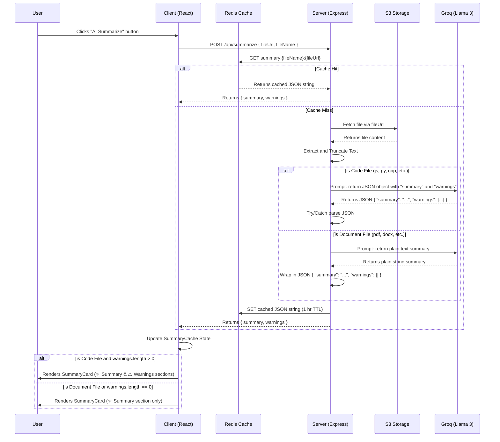

# AI Code Analysis Agent Flow

This diagram illustrates the flow for the upgraded AI Summarization and Code Analysis feature.

```mermaid
sequenceDiagram
    participant User
    participant Client (React)
    participant Redis Cache
    participant Server (Express)
    participant S3 Storage
    participant Groq (Llama 3)
    
    User->>Client (React): Clicks "AI Summarize" button
    Client (React)->>Server (Express): POST /api/summarize { fileUrl, fileName }
    
    Server (Express)->>Redis Cache: GET summary:{fileName}:{fileUrl}
    
    alt Cache Hit
        Redis Cache-->>Server (Express): Returns cached JSON string
        Server (Express)-->>Client (React): Returns { summary, warnings }
    else Cache Miss
        Server (Express)->>S3 Storage: Fetch file via fileUrl
        S3 Storage-->>Server (Express): Returns file content
        
        Server (Express)->>Server (Express): Extract and Truncate Text
        
        alt is Code File (js, py, cpp, etc.)
            Server (Express)->>Groq (Llama 3): Prompt: return JSON object with "summary" and "warnings"
            Groq (Llama 3)-->>Server (Express): Returns JSON { "summary": "...", "warnings": [...] }
            Server (Express)->>Server (Express): Try/Catch parse JSON
        else is Document File (pdf, docx, etc.)
            Server (Express)->>Groq (Llama 3): Prompt: return plain text summary
            Groq (Llama 3)-->>Server (Express): Returns plain string summary
            Server (Express)->>Server (Express): Wrap in JSON { "summary": "...", "warnings": [] }
        end
        
        Server (Express)->>Redis Cache: SET cached JSON string (1 hr TTL)
        Server (Express)-->>Client (React): Returns { summary, warnings }
    end
    
    Client (React)->>Client (React): Update SummaryCache State
    
    alt is Code File and warnings.length > 0
        Client (React)->>User: Renders SummaryCard (✨ Summary & ⚠️ Warnings sections)
    else is Document File or warnings.length == 0
        Client (React)->>User: Renders SummaryCard (✨ Summary section only)
    end
```
