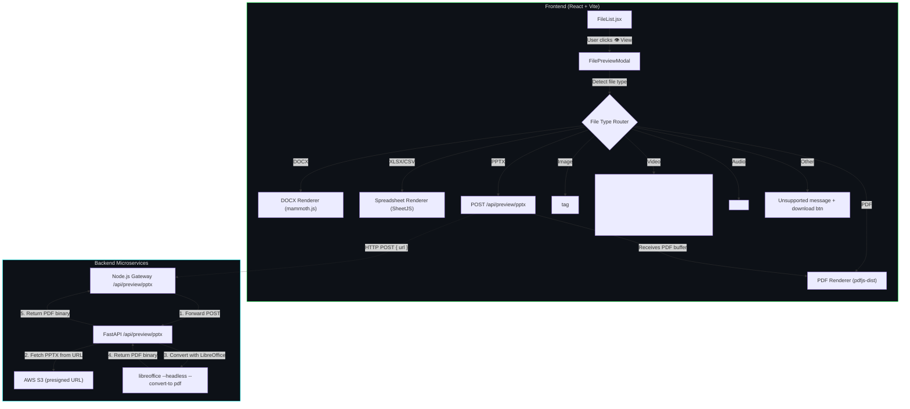

# File Preview Feature — Architecture & Implementation

## Architecture Diagram

## Files Changed / Created

| File | Action | Purpose |
|------|--------|---------|
| [FilePreviewModal.jsx](file:///c:/Users/VICTUS/OneDrive/Desktop/Internship/Personal/Code%20Share/client/src/components/FilePreviewModal.jsx) | **Created** | Modal component with type-specific renderers |
| [FilePreviewModal.css](file:///c:/Users/VICTUS/OneDrive/Desktop/Internship/Personal/Code%20Share/client/src/components/FilePreviewModal.css) | **Created** | Premium styling for the preview modal |
| [FileList.jsx](file:///c:/Users/VICTUS/OneDrive/Desktop/Internship/Personal/Code%20Share/client/src/components/FileList.jsx) | **Modified** | Added 👁 View button next to each file |
| [FileList.css](file:///c:/Users/VICTUS/OneDrive/Desktop/Internship/Personal/Code%20Share/client/src/components/FileList.css) | **Modified** | Added styles for the View button |
| [api.js](file:///c:/Users/VICTUS/OneDrive/Desktop/Internship/Personal/Code%20Share/client/src/utils/api.js) | **Modified** | Added `convertPptxToPdf()` API function |
| [client/package.json](file:///c:/Users/VICTUS/OneDrive/Desktop/Internship/Personal/Code%20Share/client/package.json) | **Modified** | Added `pdfjs-dist`, `mammoth`, `xlsx` |
| [preview.js](file:///c:/Users/VICTUS/OneDrive/Desktop/Internship/Personal/Code%20Share/server/src/routes/preview.js) | **Modified** | Express route modified to forward PPTX requests to FastAPI |
| [server/src/index.js](file:///c:/Users/VICTUS/OneDrive/Desktop/Internship/Personal/Code%20Share/server/src/index.js) | **Modified** | Mounted the preview route |
| [fastapi-server/routers/preview.py](file:///c:/Users/VICTUS/OneDrive/Desktop/Internship/Personal/Code%20Share/fastapi-server/routers/preview.py) | **Created** | FastAPI route for LibreOffice PPTX→PDF conversion |
| [fastapi-server/Dockerfile](file:///c:/Users/VICTUS/OneDrive/Desktop/Internship/Personal/Code%20Share/fastapi-server/Dockerfile) | **Created** | Dedicated Python container with LibreOffice headless |

## What Was NOT Changed

- ✅ Socket.IO events and room logic — untouched
- ✅ Redis state management — untouched  
- ✅ S3/Filebase upload flow — untouched
- ✅ Docker Compose structure — untouched (no new services)
- ✅ All existing components unrelated to file preview — untouched
