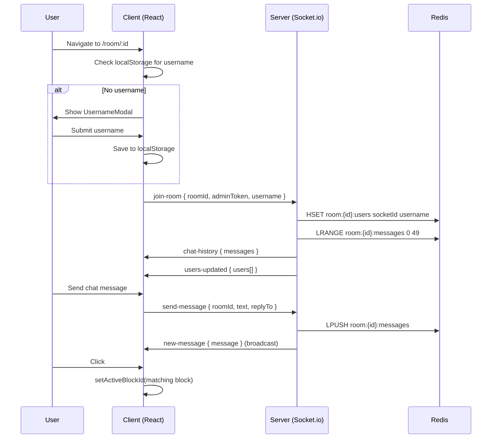

# CodeShare: Chat, Identity & UI Enhancements — Walkthrough

## Summary

Implemented 4 features as a cohesive system across 11 files:

1. **Identity & Join Room** — Username modal + Redis-backed user tracking
2. **WhatsApp-style Chat** — Replies, @mentions, #file mentions, message persistence
3. **FileList Bug Fix** — Flex overflow fix for long filenames
4. **CodeShare Integration** — #filename links switch editor tabs

---

## Architecture

---

## Files Changed

### Server

| File | Change |
|------|--------|
| [roomService.js](file:///c:/Users/VICTUS/OneDrive/Desktop/Internship/Personal/Code%20Share/server/src/services/roomService.js) | Added [addUser](file:///c:/Users/VICTUS/OneDrive/Desktop/Internship/Personal/Code%20Share/server/src/services/roomService.js#232-239), [removeUser](file:///c:/Users/VICTUS/OneDrive/Desktop/Internship/Personal/Code%20Share/server/src/services/roomService.js#240-246), [getUsers](file:///c:/Users/VICTUS/OneDrive/Desktop/Internship/Personal/Code%20Share/server/src/services/roomService.js#247-254), [addMessage](file:///c:/Users/VICTUS/OneDrive/Desktop/Internship/Personal/Code%20Share/server/src/services/roomService.js#259-267), [getMessages](file:///c:/Users/VICTUS/OneDrive/Desktop/Internship/Personal/Code%20Share/server/src/services/roomService.js#268-276) |
| [handler.js](file:///c:/Users/VICTUS/OneDrive/Desktop/Internship/Personal/Code%20Share/server/src/socket/handler.js) | Added `username` to join-room, `send-message` handler, `chat-history`/`users-updated` events, disconnect cleanup |

### Client — New Files

| File | Purpose |
|------|---------|
| [UsernameModal.jsx](file:///c:/Users/VICTUS/OneDrive/Desktop/Internship/Personal/Code%20Share/client/src/components/UsernameModal.jsx) | Centered modal to capture display name |
| [UsernameModal.css](file:///c:/Users/VICTUS/OneDrive/Desktop/Internship/Personal/Code%20Share/client/src/components/UsernameModal.css) | Glassmorphism modal styling |
| [ChatPanel.jsx](file:///c:/Users/VICTUS/OneDrive/Desktop/Internship/Personal/Code%20Share/client/src/components/ChatPanel.jsx) | Full chat UI: messages, replies, @mentions, #file mentions, RichText |
| [ChatPanel.css](file:///c:/Users/VICTUS/OneDrive/Desktop/Internship/Personal/Code%20Share/client/src/components/ChatPanel.css) | WhatsApp-style bubbles, mention highlights, dropdown |

### Client — Modified Files

| File | Change |
|------|--------|
| [useSocket.js](file:///c:/Users/VICTUS/OneDrive/Desktop/Internship/Personal/Code%20Share/client/src/hooks/useSocket.js) | Added `username` parameter, passes to `join-room` |
| [Room.jsx](file:///c:/Users/VICTUS/OneDrive/Desktop/Internship/Personal/Code%20Share/client/src/pages/Room.jsx) | Integrated UsernameModal, ChatPanel, chat socket listeners, `handleFileClick` |
| [Room.css](file:///c:/Users/VICTUS/OneDrive/Desktop/Internship/Personal/Code%20Share/client/src/pages/Room.css) | Added chat section layout, responsive rules |
| [RoomHeader.jsx](file:///c:/Users/VICTUS/OneDrive/Desktop/Internship/Personal/Code%20Share/client/src/components/RoomHeader.jsx) | Added Chat toggle button |
| [FileList.css](file:///c:/Users/VICTUS/OneDrive/Desktop/Internship/Personal/Code%20Share/client/src/components/FileList.css) | Fixed overflow: `min-width: 0`, `overflow: hidden` on flex containers |

---

## Verification

- ✅ **Build**: `vite build` — 131 modules, 548ms, zero errors
- ⏳ **Manual**: Start both servers (`npm run dev`) and test in browser with two tabs for real-time chat verification
